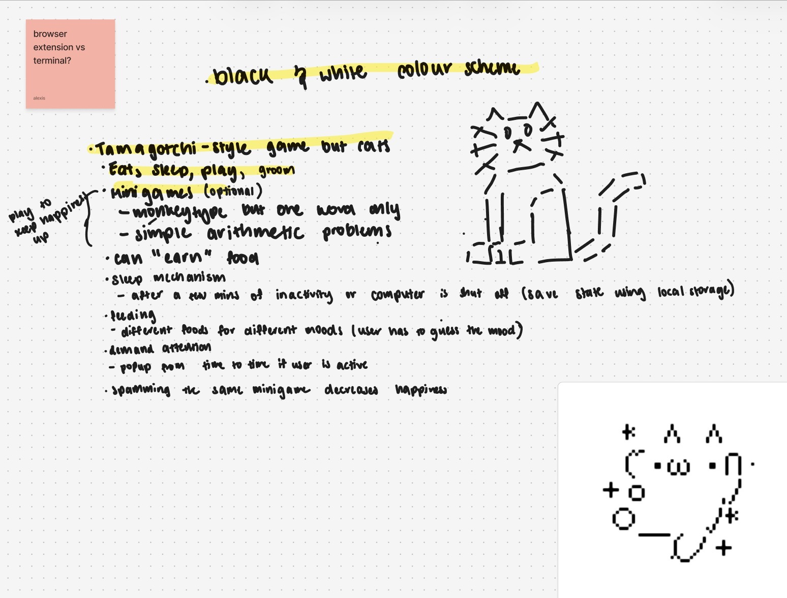
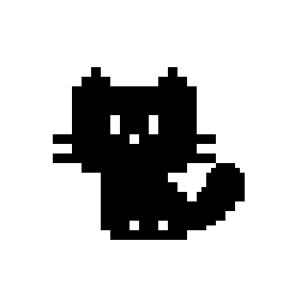

<div align="center">
    
</div>


<h1 align="center">Purrbit</h1>

  <p align="center">
    <strong>Reference ID:</strong> 6JLKEQ5T <br>
    Purrbit is a game built as a Chrome extension, inspired by the original Tamagotchi games where users take care of a pixel cat instead. Keep hunger, happiness, energy, and cleanliness up through feeding, playing, grooming, and petting.
  </p>
</div>

## Structure
```
purrbit/
├── Cat.js
├── assets/
│   ├── bgm/
│   ├── body/
│   ├── eyes/
│   ├── tails/
│   ├── emote/
│   └── icons/
├── pages/
│   ├── play.html
│   ├── home.html
│   ├── create.html
│   ├── settings.html
│   └── groom.html
├── scripts/
│   ├── play.js
│   ├── background.js
│   ├── groom.js
│   ├── create.js 
│   ├── home.js 
│   ├── audio.js 
│   └── settings.js
├── style.css
└── manifest.json
```

## Features
Main features for our game includes:
- Four core stats (hunger, happiness, energy, cleanliness) that decay over time
- Feed with fish, canned food, or treats
- Groom via a whack-a-mole style minigame
- Boost happiness by playing a random minigame (typing or math)
- Pet by hovering over the cat’s head
- Dynamic mood system reacting to stats and user actions
- Sprite-based animations for eyes, tail, and emotes
- Sleep mechanism triggered by low energy or inactivity
- Dark mode support

## Process
### From Termicat to Purrbit
Originally, our idea was ‘termicat’ — with the same premise and mechanics but run on the terminal/console instead. However, we ran into a problem where the user could resize the terminal which could break the game, and with terminals, past actions will be shown unless we cleared it first which might create lag as our cat is fully animated.

We pivoted to a Chrome extension instead, which gave us a fixed viewport, native persistence through chrome.storage.local, and the ability to build proper animations without limitations from the terminal. It was also easier for us as we had used HTML, CSS, and JavaScript a few times before.

As shown below (peep the first concept of our cat), we had a lot of ideas for the mechanisms, ranging from demanding attention to consequences for spamming minigames.



But as we progressed through our code, we realized it might be better to stay simple, especially as it’s meant to be an “easy” caretaking simulation. We scoped down to a core loop of feeding, playing, grooming, and petting — each tied to a stat that decays naturally over time and recovers through player interaction.

### Design Process
We wanted the cat to be simple to draw, but also feel alive — so every part of the cat (body, eyes, tail, extra emotes) was hand-drawn on a pixel app as separate sprite sheets, allowing us to mix and match expressions independently rather than redrawing the whole cat for every mood. This made it easy to scale if we wanted to add more moods (which we ended up doing). 

 

We kept the UI minimal and pixel-art styled to match the cat, paired with the Dogica pixel font throughout. We had originally planned for just the outline of the cat so the cat’s feeties could show. However, it made it difficult to animate the tail, as we had to make sure that the outline of the tail was consistent while making the tail animation fluid. Inconsistencies in the line thickness would be noticeable, so we decided to fully color the cat. This made it significantly easier to animate and line inconsistencies weren’t as visible.

## Technical Architecture
### Data persistence
We opted to use chrome.local.storage over localStorage for persistence. Specifically because the former is designed for extensions — it’s accessible across all extension pages (popup, side panel) not just the page that set it, which made it perfect for our case where the user can switch between popup and sidepanel. localStorage also only stores strings, which would make it difficult to save a Cat object without manually serializing and deserializing it every time, whereas chrome.storage.local handles structured data natively. 

State is saved after every interaction (feeding, playing, petting, stat decay) rather than relying on the unload event, which proved unreliable for capturing state changes before the popup closes.

### Popup and side panel option
When we first started coding with just a popup in mind, we weren’t aware that Chrome closes the popup whenever the user clicks outside of it. If we ever moved the window, the popup would close, and if we were in the middle of testing the states, we’d have to start over. This was how we decided to add a side panel option (accessible through the extension’s settings).

For users who just want to check on their cat from time to time, the popup is the perfect option. But for users who want to keep their cats on the screen at all times —maybe to watch them rest or just to have them nearby while browsing — then the side panel is the better choice. We wanted to accommodate both types of users, and it also made testing significantly easier, especially for states like inactivity that require the window to stay open over time.

### Sprite animation system
Each part of the cat — body, eyes, tail, and emotes — was separated into its own layer, positioned on top of one another so they could animate independently without redrawing the whole cat for every mood change. This meant a mood transition (e.g. idle to excited) only needed a new eye and tail sprite sheets, while the body stayed the same.

Animations were done using sprite sheets controlled using CSS background-position and the steps() timing function, which jumps between the frames rather than smoothly moving from one point to another. One challenge was correctly calculating the animation’s end position: for animations with forwards, the end position was calculated as (frameCount - 1) * frameWidth, and for animations with infinite, the end position was calculated as the full frames and frameWidth. These sprites are driven entirely by the mood system, which determines which classes to apply based on the cat’s current stats and the player’s actions.

### Mood system
The mood system is calculated using a combination of the cat’s current stats and the player’s actions. It’s split into a two-block system — the first block is used to determine the mood and the second block is used to apply changes to the UI. Stat-based moods take priority over action-based ones (for example, a hungry cat can’t become “excited” from feeding until hunger is restored), with energy taking priority over everything else. If the cat’s energy is low, it will fall asleep regardless of other stats or player actions and only wakes up when restored to a set threshold.

For moods that have chained transitions, a helper function is used for playing the transition -> hold -> return sequence. The helper function always has an exit condition, whether that’s waking up when energy is restored, or going back to an idle mood from being annoyed when a specific stat goes over the minimum threshold. To ensure that the cat’s status is updated properly, the mood is calculated after every action.

### Core game loop
Once the game starts, a timer ticks every 5 minutes, which decays the stats by 1 point. To restore these stats, the user has to perform one of four actions: feed, groom, play, pet. 

- Feed — choose between fish, canned food, or a treat, each restoring a different amount of hunger. Giving the cat a treat will surprise them.
- Groom — a whack-a-mole style minigame where the player clicks the cat as it appears randomly on one of the nine grids, restoring cleanliness based on how quickly and accurately they catch it.
- Play — a randomly selected minigame (typing or simple math) that rewards happiness for each correct answer within a time limit.
- Pet — hovering over a cat’s head for a few seconds increases happiness and a small bit of energy gradually while the player continues to pet.

If the user is inactive for 3 minutes, the cat will rest. This restores energy over time and will stop as soon as the cursor moves, waking the cat back up.
